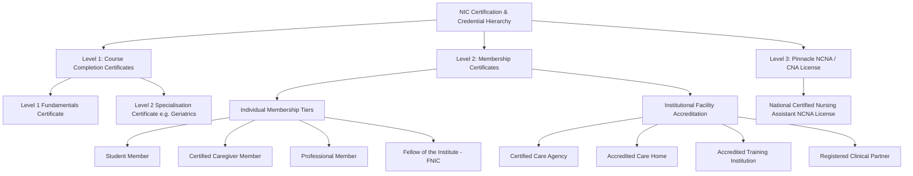

# NIC Portal — Certificate System Architecture & Credential Hierarchy

**Document ID:** ARCH-CERT-20260929-190346  
**Timestamp Identifier:** 2026-09-29 19:03:46 WAT (GMT+1)  
**Governing Body:** National Institute of Caregivers (NIC Nigeria Registry Board)  
**Status:** Approved Architecture & Blueprint  

---

## 1. Executive Summary & Purpose

This document defines the comprehensive **Certificate & Credential Architecture** for the National Institute of Caregivers (NIC) web portal. 

The credential framework establishes a multi-tiered, tamper-proof, electronically verifiable certificate system covering:
1. **Course Completion Certificates** (Level 1 & Level 2 Academic Modules).
2. **Membership Certificates** (Individual Tiers and Institutional Facility Accreditations).
3. **The Ultimate National Certified Nursing Assistant (NCNA / CNA) License** (Pinnacle Professional Qualification).

All credentials issued by NIC feature cryptographic QR verification codes resolving directly to `nicnigeria.org/verify`, embedded gold registry seals, authorized signatures, and single-page A4 landscape print styling.

---

## 2. Certificate Taxonomy & Hierarchy



---

## 3. Detailed Specification by Category

### Category I: Course Completion Certificates
* **Scope:** Awarded upon successful completion of individual academic modules within the NIC learning portal.
* **Issuance Criteria:**
  1. **100% Course Progress** across all video and reading lessons.
  2. **100% Graded & Passed Assessments** (minimum passing score of **70%** on all module quizzes/exams).
* **Certificate Code Format:** `NIC-YYYY-[5-CHAR-ALPHANUMERIC]` (e.g., `NIC-2026-X9K2P`).
* **Visual Theme:** Standard Academic Gold & Slate with course title, learning hours, completion date, and student ID.

---

### Category II: Membership Certificates

#### A. Institutional Facility Accreditation Certificates
* **Scope:** Issued to registered healthcare agencies, care homes, training providers, and clinical partners satisfying NIC facility accreditation standards.
* **Facility Classifications & Badging:**
  * **Certified Care Agency (`agency`):** Dark Slate & Gold theme (`NIC-AGY-YYYY-XXXXX`).
  * **Accredited Care Home (`care_home`):** Emerald & Gold theme (`NIC-FAC-YYYY-XXXXX`).
  * **Accredited Training Institution (`training_agency`):** Crimson & Gold theme (`NIC-TRN-YYYY-XXXXX`).
  * **Registered Clinical Partner (`hospital`):** Sky Blue & Gold theme (`NIC-CLI-YYYY-XXXXX`).
* **Validity Period:** 12 Months (Renewable annually upon inspection audit).

#### B. Individual Membership Level Certificates
* **Scope:** Issued to registered individual caregivers and healthcare professionals based on their active membership tier.
* **Tier Hierarchy:**
  1. **Student Member:** Enrolled learner undertaking foundational caregiver training.
  2. **Associate Member / Certified Caregiver:** Qualified caregiver completing Level 1 training.
  3. **Professional Member:** Certified practitioner with Level 2 specialisation and clinical experience.
  4. **Fellow of the Institute (FNIC):** Senior healthcare leader or executive recognized for exceptional contribution to caregiving.

---

### Category III: The Ultimate NCNA / CNA Professional License

* **Title:** **NATIONAL CERTIFIED NURSING ASSISTANT (NCNA)** — *Official Professional Caregiving License*.
* **Status:** The pinnacle professional credential issued by the National Institute of Caregivers Nigeria Registry Board.
* **Certificate Code Format:** `NCNA-YYYY-[5-DIGIT-ID]` (e.g., `NCNA-2026-84920`).
* **Visual Theme:** Premium Dark Slate & Burnished Gold Seal (`#c5a029`), titled *National Certified Nursing Assistant - Official Professional Caregiving License*.

#### Tri-Fold Eligibility Engine (`evaluateNCNAEligibilityAction`)
To earn the ultimate NCNA License, a student must fulfill **all three** of the following statutory requirements:

```
┌────────────────────────────────────────────────────────┐
│  Requirement 1: Level 1 Fundamentals Completion         │
│  (120 Hours Foundational Caregiving Curriculum)        │
└───────────────────────────┬────────────────────────────┘
                            │
                            ▼
┌────────────────────────────────────────────────────────┐
│  Requirement 2: Level 2 Specialisation Completion      │
│  (54 Hours Geriatrics & Gerontology or Specialty Care) │
└───────────────────────────┬────────────────────────────┘
                            │
                            ▼
┌────────────────────────────────────────────────────────┐
│  Requirement 3: Supervised Clinical Internship         │
│  (3 Months Placement at Accredited Clinical Partner)   │
└───────────────────────────┬────────────────────────────┘
                            │
                            ▼
┌────────────────────────────────────────────────────────┐
│  🏆 AUTOMATED ISSUANCE: NCNA PROFESSIONAL LICENSE      │
└────────────────────────────────────────────────────────┘
```

---

## 4. Technical Architecture & File Inventory

| Component / Layer | Target File Path | Primary Function |
| :--- | :--- | :--- |
| **Type Definitions** | [`src/types/certificate.ts`](file:///c:/Users/aforl/Desktop/NIC%20Portal/nicwebportal/src/types/certificate.ts) | Defines `PremiumCertificateData`, `CertificateTheme`, `FacilityTypeKey`, and `CertificateCategory`. |
| **High-Fidelity Renderer** | [`src/components/certificate/premium-certificate-view.tsx`](file:///c:/Users/aforl/Desktop/NIC%20Portal/nicwebportal/src/components/certificate/premium-certificate-view.tsx) | A4 Landscape single-page print component with custom themes, QR codes, and gold borders. |
| **NCNA Eligibility Engine** | [`src/lib/actions/certification-engine.ts`](file:///c:/Users/aforl/Desktop/NIC%20Portal/nicwebportal/src/lib/actions/certification-engine.ts) | Server action evaluating tri-fold NCNA requirements and issuing licenses. |
| **Student Certificate Server Action** | [`src/actions/student/certificate.ts`](file:///c:/Users/aforl/Desktop/NIC%20Portal/nicwebportal/src/actions/student/certificate.ts) | Handles course completion checks, code generation, and certificate lookup. |
| **Facility Certificate Server Action** | [`src/actions/facility/certificate.ts`](file:///c:/Users/aforl/Desktop/NIC%20Portal/nicwebportal/src/actions/facility/certificate.ts) | Fetches and formats institutional membership certificates for care agencies and facilities. |
| **Public Verification Page** | [`src/app/certificates/[code]/page.tsx`](file:///c:/Users/aforl/Desktop/NIC%20Portal/nicwebportal/src/app/certificates/%5Bcode%5D/page.tsx) | Server-rendered public verification view accessible via QR code scan or URL lookup. |
| **Database Persistence** | `public.certificates` table (Supabase) | Stores `certificate_number`, `user_id`, `type`, `issue_date`, and `verification_url`. |

---

## 5. Security, Anti-Tamper & Verification Features

1. **Cryptographic QR Verification:** Every certificate features a scannable QR code resolving directly to `https://nicnigeria.org/certificates/[code]`.
2. **Immutable Registry Record:** Certificate records are stored in PostgreSQL with Row Level Security (RLS) enabled, preventing unauthorized mutation.
3. **Single-Page Print Standard:** Custom CSS `@media print` rules enforce strict A4 landscape formatting without page breaks or background clipping.
4. **Official Signatory Seals:** Embedded digital signatures of executive directors and official institutional gold seals.

---

### Document Verification Record
- **Created By:** JBK-Core / Technical Product Architecture Team
- **Timestamp:** 2026-09-29 19:03:46 WAT (GMT+1)
- **Repo Revision:** Pushed to `origin/main` branch
