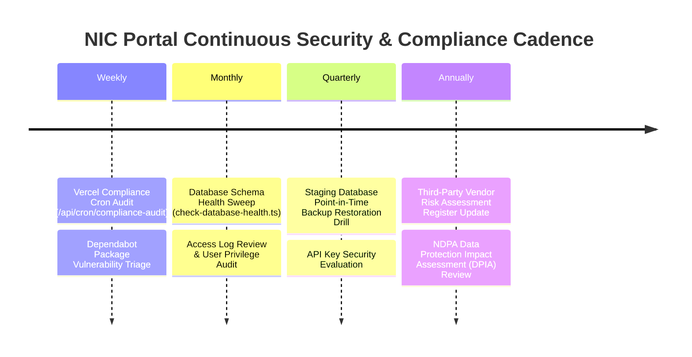

# NIC Portal — Continuous Compliance & Security Operations Playbook

**Document ID:** PLAYBOOK-SEC-004  
**Governing Standard:** SOC 2 Continuous Compliance & NDPA 2023 Operations  
**Target:** NIC Portal Infrastructure & Operations Team  

---

## 1. Executive Operations Cadence

To maintain perpetual readiness for formal SOC 2 Type II audits without incurring prohibitive software fees, NIC Portal executes a structured compliance operational schedule:

---

## 2. Operational Procedures

### A. Weekly Automated Compliance Monitor
* **Execution:** Vercel Cron automatically triggers `/api/cron/compliance-audit` every Sunday at midnight (`0 0 * * 0`).
* **Action:** Checks DB reachability, RLS state across core tables, and environment secret availability.

### B. Dependency Vulnerability Triage (Dependabot)
* **Execution:** GitHub Dependabot automatically files Pull Requests when vulnerabilities are detected.
* **Action:** Software engineering team merges patch PRs within **7 days** for critical CVEs.

### C. Quarterly Disaster Recovery & Backup Restoration Drill
* **Step 1:** Export production database snapshot (`pg_dump` or Supabase PITR export).
* **Step 2:** Restore snapshot into an isolated staging schema (`nic-staging-db`).
* **Step 3:** Run `npx tsx scripts/check-database-health.ts` against the staging instance.
* **Step 4:** Log restoration timestamp and verification metrics in `Decisions/RECOVERY_DRILL_LOG.md`.

### D. 90 to 180-Day Secret Rotation Protocol
* Rotate API keys for:
  - Paystack Gateway (`PAYSTACK_SECRET_KEY`)
  - Resend Mailer (`RESEND_API_KEY`)
  - Supabase Service Role (`SUPABASE_SERVICE_ROLE_KEY`)
* Update production secrets in Vercel Dashboard -> Environment Variables.

---

### © National Institute of Caregivers (NIC). Official Security Operations SOP.
