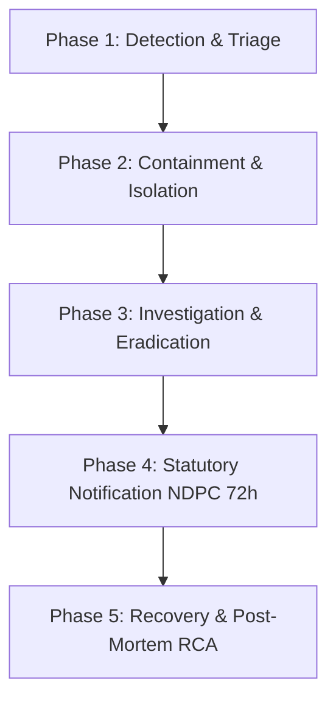

# NIC Portal — Security Incident Response Plan & Data Breach SOP

**Document ID:** SOP-SEC-002  
**Governing Authority:** Nigeria Data Protection Commission (NDPC) / NDPA 2023 Section 40  
**Effective Date:** September 2026  
**Target Platform:** National Institute of Caregivers (NIC) Infrastructure  

---

## 1. Overview & Purpose

This Incident Response Plan (IRP) defines the mandatory procedures for identifying, containing, investigating, and reporting security incidents, unauthorized data access, or data breaches within the National Institute of Caregivers digital ecosystem.

Under **Section 40 of the Nigeria Data Protection Act (NDPA 2023)**, data controllers and processors are obligated to notify the Nigeria Data Protection Commission (NDPC) within **72 hours** of becoming aware of a data breach that presents a risk to data subjects.

---

## 2. Severity Classification Matrix

| Level | Severity | Description | Target Containment Window | Escalation Lead |
| :--- | :--- | :--- | :--- | :--- |
| **P1** | **CRITICAL** | Confirmed data breach exposing user PII (NIN, Passports, credentials), unauthorized database access, or total system compromise. | **< 2 Hours** | CTO & Lead Security Architect |
| **P2** | **MAJOR** | Component outage, failed authentication provider, or unverified attempt to tamper with digital certificate verification records. | **< 6 Hours** | Lead Product Engineer |
| **P3** | **MINOR** | Isolated software bug, transient API rate-limit breach, or single non-critical user account access issue. | **< 24 Hours** | Lead Software Engineer |

---

## 3. Incident Response Lifecycle

### Phase 1: Detection & Triage
* **Detection Vectors:** Vercel error logs, Supabase security alerts, GitHub Dependabot CVE flags, or user bug reports.
* **Triage Action:** Security Architect immediately verifies whether real PII or database state was affected.

### Phase 2: Containment & Isolation
* Revoke compromised API keys (`NEXT_PUBLIC_SUPABASE_ANON_KEY`, Paystack keys, SMTP credentials).
* Enforce session revocation in Supabase (`auth.admin.signOut()`) for affected accounts.
* Deploy temporary emergency maintenance mode if database corruption is detected.

### Phase 3: Investigation & Eradication
* Inspect immutable Supabase logs (`winston` log outputs and audit trails) to trace vector of entry.
* Patch vulnerability via emergency hotfix commit to `main`.

### Phase 4: Statutory Notification (72-Hour Breach Window)
* **NDPC Notification:** If user PII was compromised, submit formal notice to the NDPC within 72 hours containing:
  1. Nature of the personal data breach.
  2. Categories and approximate number of data subjects affected.
  3. Contact details of NIC Data Protection Officer.
  4. Remediation measures taken or proposed.
* **User Notification:** Direct email communication to impacted caregivers/students explaining actions required (e.g., password reset).

### Phase 5: Recovery & Post-Mortem RCA
* Execute database restore verification from clean Supabase Point-in-Time snapshot if necessary.
* Document Root Cause Analysis (RCA) in `Decisions/RCA_[INCIDENT_DATE].md`.

---

### © National Institute of Caregivers (NIC). Confidential Engineering Document.
