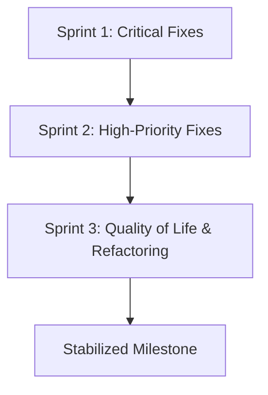

# Strategic Delivery Plan: NIC Portal Stabilization

This Delivery Plan details the execution strategy, workstreams, resource allocation, and risk management required to stabilize the NIC Portal codebase based on the Technical Health Report.

---

## 1. Execution Order & Prioritization



### 1.1 Immediate Priorities & Critical Fixes
* **Task:** **Rate-limit Public Password Reset requests.**
  * *Rationale:* Prevent active cost expansion and email account suspension from Resend.
  * *Confidence Score:* **95%** (Standard Upstash middleware implementation, zero dependencies required).
* **Task:** **Enable RLS on Registry/Facilities & Inspections.**
  * *Rationale:* Prevent unauthorized read/write access to sensitive data via the client-side Supabase client.
  * *Confidence Score:* **90%** (Standard SQL migration schema path).

### 1.2 High-Priority Fixes
* **Task:** **Refactor Inactivity Timeout Cookie to cover background API requests.**
  * *Rationale:* Resolve UX bug where active users get logged out suddenly due to inactivity trackers only listening to page routing events.
  * *Confidence Score:* **85%** (Needs verification of fetch headers in server components).
* **Task:** **Refactor Mobile Curriculum Layout on the Course Player page.**
  * *Rationale:* Enhance mobile learning accessibility.
  * *Confidence Score:* **90%** (Pure CSS / responsive structural change).

### 1.3 Deferred Work
* **Task:** **Refactoring implicit grant flows to PKCE for admin-generated invites.**
  * *Rationale:* Needs Supabase platform-level features or custom backend middleware to convert tokens, which adds substantial complexity. We defer this until primary authentication mechanisms are hardened.
  * *Confidence Score:* **70%**.

---

## 2. Resource Allocation & Workstreams

To optimize delivery, we structure the work into two concurrent workstreams:

```
┌───────────────────────────────────────────────────────────────────┐
│                           Workstream 1                            │
│           Security, RLS & Middleware (Backend Engineer)           │
└───────────────────────────────────────────────────────────────────┘
                                  │
┌───────────────────────────────────────────────────────────────────┐
│                           Workstream 2                            │
│              UX & Responsive Styling (Frontend Engineer)          │
└───────────────────────────────────────────────────────────────────┘
```

* **Workstream 1: Security, RLS & Middleware**
  * *Focus:* Upstash rate-limiting integration, RLS migrations, and middleware refinement.
  * *Staffing:* 1 Backend/Security-focused Engineer.
* **Workstream 2: UX & Responsive Styling**
  * *Focus:* Course player layout, mobile curriculum drawer implementation, and UI polishing.
  * *Staffing:* 1 Frontend/Product Engineer.

---

## 3. Risk Mitigation

| Identified Risk | Impact | Mitigation Strategy |
| :--- | :--- | :--- |
| Upstash Rate Limiter Downtime | Medium | Implement fail-open defaults to prevent locking legitimate users out during Redis service interruptions. |
| RLS Migration Lockout | High | Run SQL changes in staging environment first. Keep local backup files. |
| Inactivity cookie bypass failures | Low | Validate with thorough automated route testing across both Server Actions and endpoints. |

---

## 4. Recommended Sprint Structure (2-Week Iterations)

### Sprint 1: Security Hardening (Weeks 1 - 2)
* **Goal:** Hardened authentication API endpoints and secure database access.
* **Deliverables:**
  * Rate limiting applied to `/actions/auth/request-reset`.
  * RLS policies active on `facilities` and `inspections`.
  * Cleaned up development artifacts and scratch files from the repository.

### Sprint 2: Platform Robustness (Weeks 3 - 4)
* **Goal:** Flawless mobile curriculum navigation and correct session timeouts.
* **Deliverables:**
  * Inactivity checks updated in middleware to parse background requests.
  * Collapsible mobile drawer implemented for course player curriculum list.

---

## 5. Protocols & Brain Entries

### 5.1 Knowledge Handoff Protocol
When deploying authorization changes, the following contexts must be verified:
1. Validate that `admitMemberAction` and `invite-member.ts` continue generating valid reset/invite links without silent failures.
2. Confirm the URL hash containing the `access_token` correctly falls back onto `/reset-password` without throwing a `404` or looping redirection.

### 5.2 Candidate Brain Entries
* **Auth Scheme Boundary:** Supabase SSR handles login via PKCE but admin generation flows must use Hash implicit parsing. Ensure future updates do not attempt server-side redirects on hashes.
* **Middleware Interceptor whitelist:** Always ensure static resources are whitelisted to prevent performance overhead on local assets.
